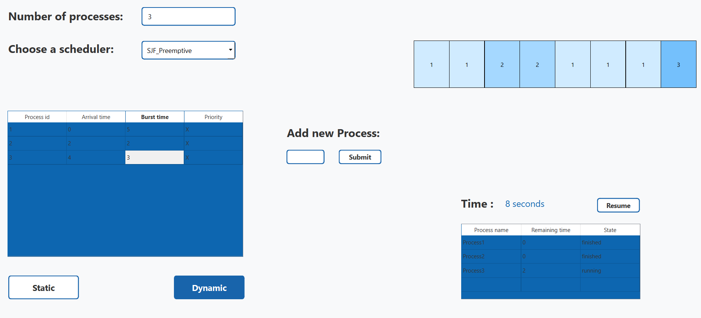

# CPU Scheduler Simulator :

This project is a GUI application developed in C++ using Qt framework to simulate various CPU scheduling algorithms. The implemented algorithms include:

1. First-Come, First-Served (FCFS)
2. Shortest Job First (SJF) - Preemptive
3. Shortest Job First (SJF) - Non-preemptive
4. Priority Scheduling - Preemptive
5. Priority Scheduling - Non-preemptive
6. Round-Robin

Users can interact with the program through the following components:

1. **Textbox**: Enter the number of processes.
2. **Combo box**: Select one of the six algorithms.
3. **Table**: Enter Arrival time, Burst time, and optionally Priority for each process.
4. **Textbox**: Enter quantum time in the case of Round-Robin algorithm.
5. **Buttons**: Select whether to perform static or dynamic simulation.
    - **Static**: Display the final Gantt chart after all processes have finished, along with the time passed, average waiting time, and average turnaround time.
    - **Dynamic**: Display the Gantt chart after every second, with a timer indicating the time passed, a ready queue showing processes currently ready to execute, remaining burst time, and state column (ready, running, finished). At the end, display the average waiting time and average turnaround time.
6. **Stop and Resume button**: Allows pausing and resuming dynamic scheduling.
7. **Button and Textbox**: Add new processes while the scheduler is running.

The Gantt chart representation consists of rectangles drawn sequentially, with each rectangle representing a process. The center of each rectangle contains the process number, while 'X' denotes idle time. Each process is assigned a different color for easy identification.

An executable file (exe) exists for the application. To run the program, follow these steps:

1. Download `exe.zip` from the repository.
2. Extract the contents of `exe.zip`.
3. Run the extracted executable file (`OSS.exe`).

### Screenshots

1. FCFS Scheduler

2. SJF Preemptive Scheduler

3. SJF Non-preemptive Scheduler

4. Priority Preemptive Scheduler

5. Priority Non-preemptive Scheduler

6. Round-Robin Scheduler

If you encounter any issues or have suggestions, please open an issue in the repository.
